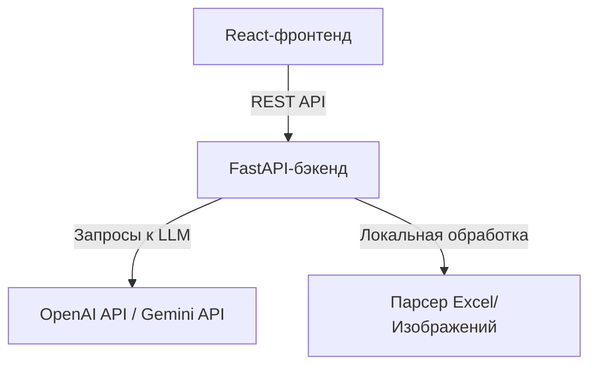

# Архитектура проекта - QA-Assistant

В этом документе описывается архитектура и файловая структура проекта **QA-Assistant**.

## Компоненты

QA-Assistant спроектирован как разделенный монорепозиторий, содержащий бэкенд на FastAPI и фронтенд на React + Vite + TypeScript.



### 1. Бэкенд (Python + FastAPI)
Бэкенд предоставляет stateless (не хранящие состояние) API-эндпоинты для управления пошаговым процессом. Он не сохраняет сессии в базу данных для максимальной гибкости; вместо этого состояние передается между клиентом и сервером или хранится в стандартных моделях сессии.

Основные модули:
- **API Эндпоинты (`app/api/`)**: Обработчики для анализа требований, изменения матрицы трассируемости, работы с вопросами, генерации тест-кейсов и сравнения версий сценариев. Также содержит роуты для получения списка моделей (`POST /models`) и конфигурации сервера (`GET /info`).
- **Сервис работы с LLM (`app/services/llm_service.py`)**: Взаимодействует с API OpenAI/Gemini. Поддерживает **динамическую инициализацию**, создавая клиентские подключения «на лету», когда кастомные учетные данные пользователя передаются в полезной нагрузке запроса, с переключением на переменные окружения сервера или локальный Mock-режим.
- **Сервис парсеров (`app/services/parser.py`)**: Отвечает за обработку прикрепленных файлов (чтение Excel-таблиц и распознавание текста на скриншотах).

### 2. Фронтенд (React + Vite + TypeScript)
Фронтенд представляет собой одностраничное приложение (SPA) на React. Оно управляет пользовательским интерфейсом на протяжении либо 5 этапов (Новый тест-дизайн), либо 6 этапов (Актуализация существующего).

Основные элементы:
- **Дизайн-система (`src/index.css`)**: Реализует светлую, минималистичную, компактную glassmorphism-верстку с использованием чистого CSS.
- **Глобальное состояние (`src/context/DesignContext.tsx`)**: Управляет активной сессией пользователя, включая требования, текущую матрицу, очередь вопросов, активные настройки модели, сгенерированные тест-кейсы и результаты сравнения.
- **Экраны этапов (`src/views/`)**: Раздельные интерфейсы для каждого этапа, что позволяет изолировать логику конкретного шага.

## Схема данных и взаимодействие

Бэкенд использует Pydantic-модели для валидации входных и выходных данных на каждом этапе. Так как состояние хранится на клиенте:
1. **Этап 1 -> Этап 2**: Пользователь загружает требования и файлы. Бэкенд возвращает список структурированных требований с уникальными идентификаторами (например, `RQ-01`, `RQ-02`).
2. **Этап 2 -> Этап 3**: Пользователь редактирует список требований. При переходе дальше бэкенд передает итоговый список требований в LLM для генерации уточняющих вопросов.
3. **Этап 3 -> Этап 4**: Пользователь отвечает на вопросы. Требования и ответы отправляются на бэкенд. LLM генерирует тест-сценарии в стандартном формате:
    ```
    TC-###: [Название] - [Приоритет]
    Предусловия: ...
    Шаги: ...
    Ожидаемый результат: ...
    Покрытие требований: ...
    ```
4. **Этап 4 -> Этап 5 (Актуализация) / Этап 5 (Новый)**:
    - В режиме **Нового тест-дизайна** бэкенд сопоставляет тест-кейсы с требованиями для построения финальной матрицы трассируемости (Этап 5).
    - В режиме **Доработки существующего** бэкенд сначала сравнивает новые тест-кейсы со старыми (введенными на Этапе 1) для генерации отчета об изменениях (Этап 5), а затем выводит итоговую матрицу и сценарии (Этап 6).
