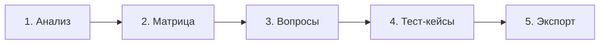
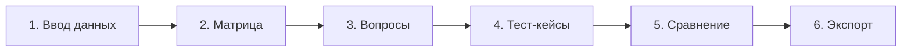

# Этапы и рабочие процессы - QA-Assistant

QA-Assistant помогает пользователям выполнять структурированный процесс проектирования тестов с помощью искусственного интеллекта. Порядок работы зависит от выбранного режима.

---

## Настройка LLM (Главный экран)
Перед началом проектирования пользователь может настроить параметры корпоративной нейросети (Kaspersky LLM на базе OpenAI-совместимого эндпоинта) прямо на главной странице.
- Настройки сохраняются в локальном хранилище браузера (`localStorage`).
- На всех этапах (с Шага 1 по Шаг 5/6) под индикатором выполнения отображается плашка **Активной модели**, показывающая, какая модель обрабатывает запросы. Цвет точки статуса меняется в зависимости от того, используется ли реальное подключение (зеленый) или серверный Mock-режим (оранжевый/желтый).

---

## Режим 1: Новый тест-дизайн (5 этапов)

### Этап 1: Анализ и ввод требований
-   **Действие пользователя**: Вводит исходные требования (текст), примечания и загружает прикрепленные файлы (изображения интерфейсов, таблицы Excel).
-   **Действие системы**: Считывает требования и объединяет контекст из прикрепленных файлов.
-   **Переход**: Нажмите «Продолжить», чтобы сформировать требования в виде матрицы.

### Этап 2: Настройка матрицы трассируемости
-   **Действие пользователя**: Проверяет извлеченные требования. Может добавлять новые строки, редактировать описания или удалять ненужные.
-   **Действие системы**: Отображает таблицу требований с их уникальными идентификаторами (например, `RQ-01`, `RQ-02`) и инициализирует счетчик покрывающих тестов значением 0.
-   **Переход**: Нажмите «Сгенерировать вопросы», чтобы запустить анализ логики требований.

### Этап 3: Уточняющие вопросы
-   **Действие пользователя**: Отвечает на вопросы, сформированные LLM по логическим "серым зонам" требований.
    -   Может написать ответ в текстовом поле и нажать **«Ответить»**.
    -   Может нажать **«Не рассматривается»**, чтобы автоматически записать ответ *«Не рассматривается в рамках требования»* и продвинуться дальше.
    -   Может нажать **«Пропустить»**, чтобы отложить вопрос (он переносится в конец очереди).
    -   Видит текущий прогресс в виде **«Вопрос X из Y»**.
-   **Действие системы**: Анализирует требования, находит неопределенности и ведет очередь вопросов.
-   **Экран сводки (после ответов)**: Отображает раздел **«Сводка по ответам на вопросы:»** со списком ответов.
    -   **Изменить ответ**: Позволяет скорректировать любой ответ прямо в списке (inline).
    -   **Вернуть к вопросу**: Удаляет ответ и возвращает вопрос на экран в активную очередь.
-   **Переход**: После подтверждения сводки нажмите «Начать тест-анализ» для генерации тест-кейсов.

### Этап 4: Генерация тест-сценариев
-   **Действие пользователя**: Изучает сгенерированные тест-кейсы. Может:
    -   Редактировать тест-кейсы (предусловия, шаги, ожидаемые результаты, приоритет, покрытие требований).
    -   Удалять тест-кейсы.
    -   Создавать новые тест-кейсы вручную.
-   **Действие системы**: LLM генерирует тест-кейсы на основе матрицы требований и ответов на уточняющие вопросы.
-   **Переход**: Нажмите «Далее» для компоновки результатов.

### Этап 5: Матрица трассируемости и экспорт
-   **Действие пользователя**: Просматривает готовую матрицу покрытия и экспортирует тест-кейсы.
-   **Действие системы**: Строит матрицу трассируемости, сопоставляя требования (строки) со сценариями (столбцы), подсчитывает покрытие для каждого требования. Позволяет экспортировать матрицу трассируемости в .CSV. Выводит готовые тест-кейсы в виде наглядного визуального аккордеона с интерактивными тултипами покрытия требований и возможностью скопировать весь Markdown-текст в один клик.

---

## Режим 2: Доработка существующего тест-дизайна (6 этапов)

### Этап 1: Ввод требований и существующих тестов
-   **Действие пользователя**: Вводит новые требования, примечания, прикрепляет файлы и вставляет старый текст тест-кейсов (предыдущие сценарии).
-   **Переход**: Нажмите «Продолжить» для разбора входных данных.

### Этап 2: Настройка матрицы
-   **Действие пользователя**: Аналогично Режиму 1 Шагу 2. Пользователь утверждает список требований.

### Этап 3: Уточняющие вопросы
-   **Действие пользователя**: Аналогично Режиму 1 Шагу 3. Пользователь устраняет логические дыры в требованиях с возможностью редактирования ответов и автоматического сброса.

### Этап 4: Генерация сценариев
-   **Действие пользователя**: Аналогично Режиму 1 Шагу 4. Система генерирует обновленные тест-кейсы.

### Этап 5: Сравнение
-   **Действие пользователя**: Изучает разницу между версиями.
-   **Действие системы**: LLM сопоставляет старые требования и тест-кейсы с новыми и выводит структурированный отчет об изменениях (Diff Report) в трех разделах: изменения в требованиях, изменения сценариев, и статистика Было/Стало по приоритетам (П1, П2, П3), поддерживая копирование в один клик.

### Этап 6: Матрица трассируемости и экспорт
-   **Действие пользователя**: Просматривает и копирует финальную матрицу трассируемости, новые тест-сценарии и отчет об изменениях.
-   **Действие системы**: Аналогично Режиму 1 Шагу 5 (вывод матрицы с экспортом в CSV, интерактивного списка тест-кейсов и панели отчета об изменениях).
